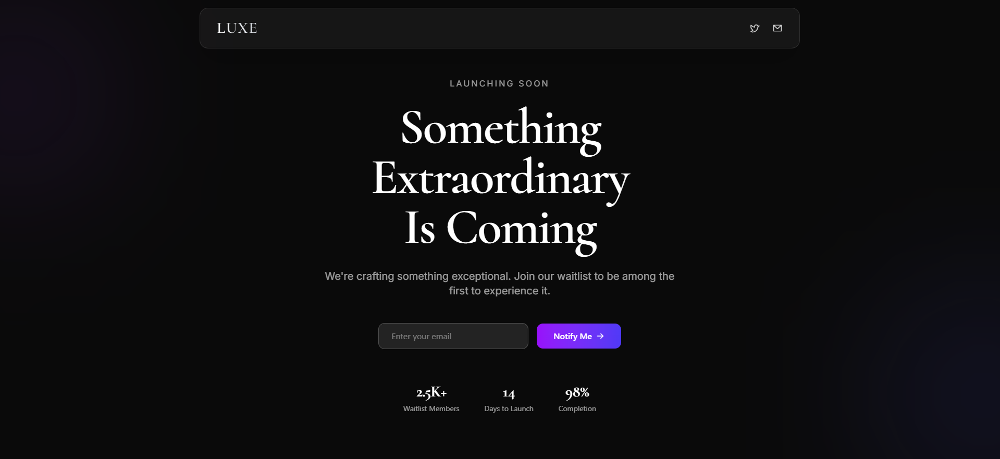

# LUXE — Premium Coming Soon Template



A sophisticated, animated coming soon template crafted with modern web technologies. Features a premium glass-morphism design, smooth animations, and responsive layout.

## ✨ Features

- 🎨 Premium glass-morphism design
- 🌗 Dark theme with luxury aesthetics
- 🎭 Smooth animations powered by Framer Motion
- 📱 Fully responsive across all devices
- ⚡️ Built with performance in mind
- 🔧 Easy to customize and maintain

## 🛠 Tech Stack

- [Next.js 15](https://nextjs.org/) - React Framework
- [TailwindCSS 4](https://tailwindcss.com/) - Utility-first CSS Framework
- [Framer Motion](https://www.framer.com/motion/) - Animation Library
- [Phosphor Icons](https://phosphoricons.com/) - Premium Icons

## 🚀 Quick Start

```bash
# Clone the repository
git clone https://github.com/danishkhanx/Waitlist-Page.git

# Navigate to the project
cd Waitlist-Page

# Install dependencies
npm install

# Start development server
npm run dev
```

Visit `http://localhost:3000` to view the template.


<div align="center">
  <sub>Built with ❤️ by Danish</sub>
</div>
